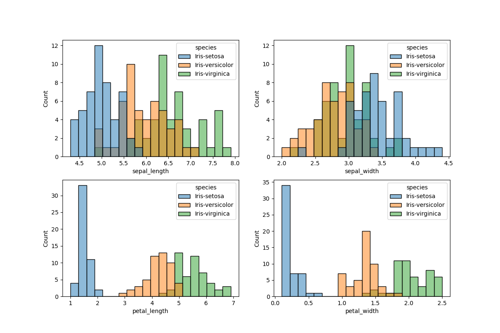
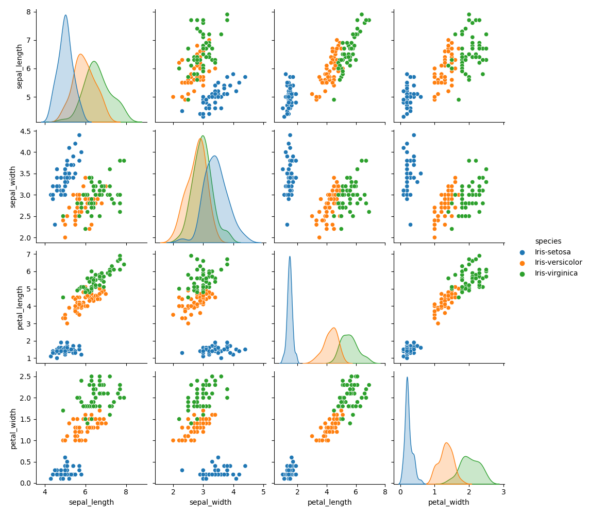

# Pands Project 2021
Emma Farrell's submission of the project for the Programming and Scripting module.

# Project Purpose
The purpose of this project is to use Python to interpret the Iris Data Set through a Data Analytics lens. 

# Table of Contents
* [The Iris Data Set](#the-iris-data-set)
    * [Background](#background)
    * [Data Within the Dataset](#data-within-the-dataset)
    * [Analysis Purpose](#analysis-purpose)
* [Analysis](#analysis)
    * [Libraries Used](#libraries-used)
    * [Data Input and Storage](#data-input-and-storage)
    * [Data Manipulation and Calculations](#data-manipulation-and-calculations)
    * [Data Output](#data-output)
* [Results](#results)
    * [Plots](#plots)
    * [Tables](#tables)
* [Conclusions](#conclusions)
    * [Further Study](#further-study)
* [References](#references)

# The Iris Data Set
## Background
Fisher’s Iris Data Set is a set of data that describes the dimensions of three species of the iris flower. The dataset was gathered by botanist Edgar Anderson and used by statistician Ronald Fisher in his 1936 paper “The use of multiple measurements in taxonomic problems” to demonstrate a method used in statistics called linear discriminant analysis. This method can be used in statistics to characterise two or more classes of data, which is useful for analysing and categorising data. The dataset is used often today as a test set in machine learning to demonstrate pattern recognition.

## Data Within the Dataset
The data itself is comprised of 150 sets of measurements of two components of the flowers, the petal and the sepal.
<figure>

<figcaption>Figure 1: Species of iris flower measured for the Iris Data set. The measurements were taken from the petal and sepal (labelled)</figcaption>
</figure>
 There are five columns of data: four measurements and the species of iris the flower belongs to. The measurements are sepal length, sepal width, petal length and petal width. There are three species of iris in the dataset: setosa, versicolor and virginica. There are 50 measurements of each species of iris.

 Below is a view of the first five rows of the dataset: 

            sepal_length |   sepal_width |   petal_length |   petal_width | species     |
                     5.1 |           3.5 |            1.4 |           0.2 | Iris-setosa |
                     4.9 |           3   |            1.4 |           0.2 | Iris-setosa |
                     4.7 |           3.2 |            1.3 |           0.2 | Iris-setosa |
                     4.6 |           3.1 |            1.5 |           0.2 | Iris-setosa |
                     5   |           3.6 |            1.4 |           0.2 | Iris-setosa |

## Analysis Purpose
The purpose of this analysis is to use the Python programming language to analyse the data in this dataset and demonstrate the relationship between the different inputs and how they may differ according to species.

# Analysis

## Libraries Used
The Python libraries used in this analysis are pandas, matplotlib.pyplot, seaborn, os and tabulate. A module called **file_i_o.py** was created as part of this project to store functions that handled saving output files. This involved saving file_i_o as a normal python script in the same folder as the analysis file and importing it like the other libraries at the beginning of the analysis script.

            import file_i_o as f

The file_i_o module used the **os** module in a function that checked if files already existed. The purpose of this is to prevent certain sections of code (that would output a file) from running if there was already an output file in the folder. The file_i_o module also handled outputting results to a text file using tabulate (discussed below) and saving plots to image files using matplotlib.pyplot. 

**Pandas** was used because it has a lot of useful functionality, mostly through the use of dataframes. A dataframe is an object that stores data structures (from sources such as CSV files) in such a way that makes it easy to access and manipulate the data. Pandas has functions to allow the programmer to select data based on conditions, handle empty entries, and pivot the data to change the structure among other things. This makes it a powerful tool which was useful for this analysis.

**Seaborn** is a library that creates plots. It is built on functions in Matplotlib, and both were used in this analysis. Seaborn was required for more advanced plotting such as pairplot, and **Matplotlib** was required for basic functions like saving the plots to image files.

The other library of note is **Tabulate**, which outputs data structures as text in a tabulated form. Its main advantages is that it can handle objects such as pandas dataframes, which are difficult to output as plain text in a format that is informative. 

## Data Input and Storage
The file downloaded from the site is a simple text file. The values are all separated with commas, so it was saved as a .csv file (comma separated values). The Pandas library is able to read in csv files and process them in a way that makes it easy to perform analysis on the data and output it to plots; this is done by saving the data to a dataframe. This is done by the .read_csv() function. 

            iris_data_frame = pd.read_csv("../irisdata.csv", names = column_names)

There were no column headers in the original file, so they had to be saved as a list to be passed as an argument into the function above. 

The data required for the analysis is now stored in the variable iris_data_frame. This variable is a dataframe, which is a special type of object. Data can be accessed easily, for example to store the measurements of petal length that are less than 1.5cm: 

            small_petal = iris_data_frame[iris_data_frame['petal_length'] < 1.5]

## Data Manipulation and Calculations
To make analysis on individual species easier, the dataframe was subdivided into three dataframes and saved in new variables (this did not affect the data stored in the original iris_data_frame):

            setosa_df = iris_data_frame[iris_data_frame['species'] == 'Iris-setosa']
            versicolor_df = iris_data_frame[iris_data_frame['species'] == 'Iris-versicolor']
            virginica_df = iris_data_frame[iris_data_frame['species'] == 'Iris-virginica']

Calculations were done using pandas functions that perform calculations on dataframes and output the result in either a dataframe or a data series (an object similar to a dataframe). The functions used in this analysis were **.describe()** and **.corr()**. 

            iris_data_frame.describe()
            iris_data_frame.corr()

The **describe** function calculates the count, mean (same as average), standard deviation, min, max and 25%, 50% and 75% percentiles of the data in the dataframe and outputs them to a data series. This is a useful overview of data to have. This was done on the data as a whole and on the data broken down by species to get a better view of how the features of the species differ from each other. 

The **corr** function (short for correlation) calculates the correlation coefficient for all pairs of numeric columns in a dataframe. A calculation is carried out on all of the data in one column and this is compared with all of the data in the other columns, until every column has been compared with every other column and a result is calculated for each column pair. 

There are many different methods of calculating correlation, this function uses the Pearson method by default and this was used in this analysis. The correlation coefficient is a number between 0 and 1 that shows how related two sets of data are to each other. The closer to 1, the more correlation there is. A negative number shows an inverse relationship, i.e. as one variable increases, the other decreases. 

This function takes all of the numeric columns and compares them with each other, outputting a dataframe with the results. Observing the [results](#results), it is noted that in the comparison process, each column gets compared with itself, giving a correlation of 1 in the left to right diagonal descending entries. These results are not useful for telling us anything about features being observed. 

## Data Output
### File Handling
The results of the analysis was output as tables to a text file (.txt) and as plots to image files (.png). 

The module created for the analysis file_i_o is used to handle file output. Before a file is created, the **check_file_exists()** function is called to see if the file already exists. This uses the **os.path.exists()** function from the os module, and returns True if the file already exists and False if the file does not exist. 

            def check_file_exists(file_path):
                return os.path.exists(file_path)

### Figures
The data was plotted using functions from Seaborn and Matplotlib.pyplot libraries. **Histograms** and **pairplots** were chosen to plot the data because they provide visual represntations of data that can enable comparison between different sub-groups, in this case, species. Pair plots in particular are useful for comparison of pairs of features using correlation, similar to the corr function mentioned in the [data manipulation and calculations](#data-manipulation-and-calculations) section above. 

The histograms were plotted using a subplot, allowing multiple histograms to be produced in one file, which is useful for comparison. The features to be plotted were saved to a list and a for loop iterated over an enumerated version of this list to create multiple histograms. 

            histplot_list = ['sepal_length', 'sepal_width', 'petal_length', 'petal_width']
            for i in enumerate(histplot_list):
                plt.subplot(2, 2, i[0]+1)
                sb.histplot(data = iris_data_frame, x=i[1], hue='species', bins=20)

The enumerate() function takes in an iterable (such as a list) and returns a list of tuples consisting of each list item's index and the item itself:

            enumerate(histplot_list) = [(0, 'sepal_length'), (1, 'sepal_width'), (2, 'petal_length'), (3, 'petal_width')]

The 'i' in the for loop above refers to each tuple in the list as it is iterated over. The items in the tuple are accessed using indexing. In this case, in the first iteration, i[1] will refer to 'sepal_length', in the third iteration, i[1] will refer to 'petal_length' etc. i[0] will always refer to the index that the item had in the original list e.g. i[0] for the second iteration (sepal_width) will be 1.

The arguments in the subplot function are rows, columns and figure id. The subplot function above arranges the 4 histograms in a 2x2 square. The figure id cannot be zero, so to get around this, 1 is added to the value in i[0]

The histplot function creates the histogram. The dataframe passed as an argument provides the data to be plotted and the second index of the tuples in the enumerated list tells the function what to use as the x axis in the plot. The hue argument tells the histogram function to colour code the data according to a particular column, in this case species. The bins argument tells the function how many portions the histogram will be divided into on the x axis.

The pairplot function outputs multiple plots comparing pairs of variables. The hue argument can be used again to colour code according to species.

            sb.pairplot(iris_data_frame, hue = 'species')

The **save_fig** function created in the file_i_o module is used to save the plot image files, using the savefig function from matplotlib.pyplot.

            def save_fig(fig_filename):
                plt.savefig(fig_filename)

### Text
The [data manipulation and calculations](#data-manipulation-and-calculations) section above describes the calculations that were performed for the text output. The results of these calculations were saved to a text file using both the file_i_o module and the **tabulate** module. In the file_i_o module, a function called read_df_to_file read dataframes to the text file. It took in the data frame, a title for the table, a list for column headers and a filename as arguments. It carried out some formatting for the beginning and end of the tables to distinguish the tables from each other and put a descriptive title at the top. 

            def read_df_to_file(data_frame, title, col_headers, filename):
                ...
                with open(filename, 'at') as ft:
                    ...
                    ft.write(t.tabulate(data_frame, headers=col_headers, tablefmt="github"))

The tabulate function takes in a dataframe, a list for column headers and a format style and outputs a formatted table as a string, which made the process of writing to a file in a readable way very user friendly, to both a programmer and a reader of the table. Because a dataframe is an object datatype, if it is directly written to a text file, the data cannot be read in a readable way. 

There are various styles available and they are set using the tablefmt argument. The code above uses the github style, chosen for showing borders around the columns making data easier to read. 

Examples of the tables can be seen in the [tables](#tables) section in the Results below. 

# Results
## Plots
Below are the plots generated by the analysis script. The histogram shows a good basic comparison of how the size of sepals and petals compare between the different species. The pairplot shows more in-depth comparisons with a distribution plot when a variable is being compared with itself.

<figure>

<figcaption>Figure 2: Histogram generated by the analysis script.</figcaption>
</figure>

The histogram shows that there is a lot of overlap between the species in the sepal measurements, whereas the setosa species is noticably smaller and has a narrower petal measurement range than versicolor and virginica. In general, virginica has the largest measurements, followed by versicolor then setosa, except for sepal width where setosa has larger, but wider ranging, measurements. This implies that the setosa petals are short and narrow when compared to the other species, and their sepals are short but wide in comparison. 

<figure>

<figcaption>Figure 3: Pairplot generated by the analysis script</figcaption>
</figure>

The results in the histograms are reflected in the pair plot, with even more insight given into how the species compare. Verdicolor and virginica have more similarities/overlap in measurement when compared with setosa. 

## Tables
Below is the data summary and correlation results for all species. To see the data summary and correlation results broken down by species, see the analysis_output.txt file.

            				==============================================
				                *** Data Summary (all species) *** 
				            ==============================================

                | value   |   sepal_length |   sepal_width |   petal_length |   petal_width |
                |---------|----------------|---------------|----------------|---------------|
                | count   |     150        |    150        |      150       |    150        |
                | mean    |       5.84333  |      3.054    |        3.75867 |      1.19867  |
                | std     |       0.828066 |      0.433594 |        1.76442 |      0.763161 |
                | min     |       4.3      |      2        |        1       |      0.1      |
                | 25%     |       5.1      |      2.8      |        1.6     |      0.3      |
                | 50%     |       5.8      |      3        |        4.35    |      1.3      |
                | 75%     |       6.4      |      3.3      |        5.1     |      1.8      |
                | max     |       7.9      |      4.4      |        6.9     |      2.5      |

.

                                ==============================================
                                *** Variable Correlations (all species) *** 
                                ==============================================

                |              |   sepal_length |   sepal_width |   petal_length |   petal_width |
                |--------------|----------------|---------------|----------------|---------------|
                | sepal_length |       1        |     -0.109369 |       0.871754 |      0.817954 |
                | sepal_width  |      -0.109369 |      1        |      -0.420516 |     -0.356544 |
                | petal_length |       0.871754 |     -0.420516 |       1        |      0.962757 |
                | petal_width  |       0.817954 |     -0.356544 |       0.962757 |      1        |

# Conclusions
In conclusion, Python has some powerful tools that can be used to analyse and visualise data. In this analysis, these tools were applied to the Iris Data Set to demonstrate how to use various libraries to store, manipulate and perform calculations on data to gain insights into how the data, and therefore the features of three species of iris. 

The iris data set is a useful set of data to begin performing analysis on using these methods, as most of the data is of the same type (measurements as opposed to features or categories) but it allows for some complexity with the different iris species coming into play in the calculations. 

## Further Study
Some additional analysis that could be done on the data set would be to compare mins and maxes of the different species. Pandas has functionality to pivot dataframes to rearrange the data to categorise it in different ways. There are other methods of visualisation of the data, such as boxplots and bean plots. 

The iris data set is also used in training algorithms used in machine learning. 

# References